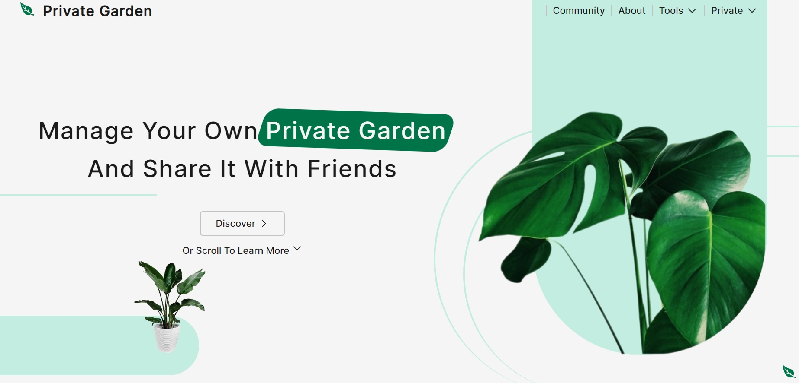
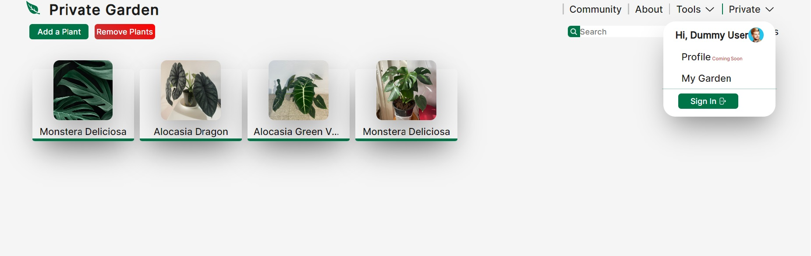
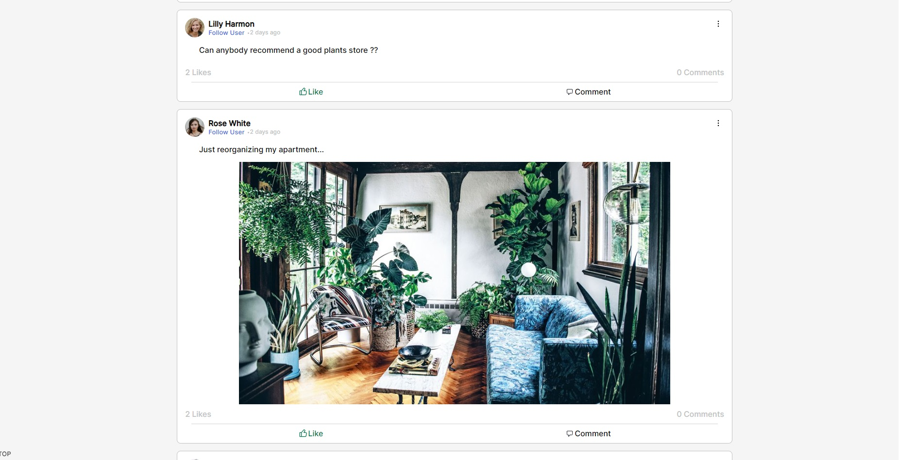

# Private Garden

## What is Private Garden

A web app that helps you monitor your own garden by creating a timeline for each plant and update anything about it.
This is the frontend of the app.

## What's Next?
Currently working on a community section where the app users will be able to get advice from one another, share posts about updates regarding their plants and everything else that is plants related.

In the long term the app can also be useful for studying purposes, when looking back at the timeline.

it was created using:

* React
* Vite
* TypeScript
* SCSS

## 🛠️ How to run

* npm install
* npm start

remember that this is the frontend only.

## 📸 Screenshots

